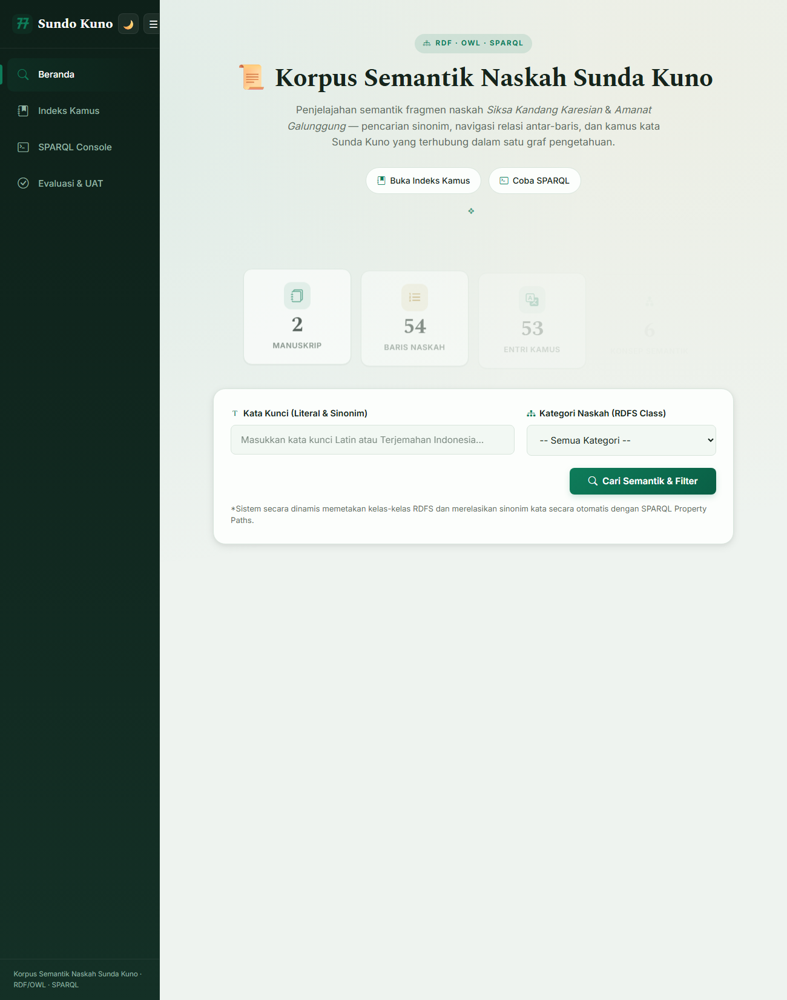
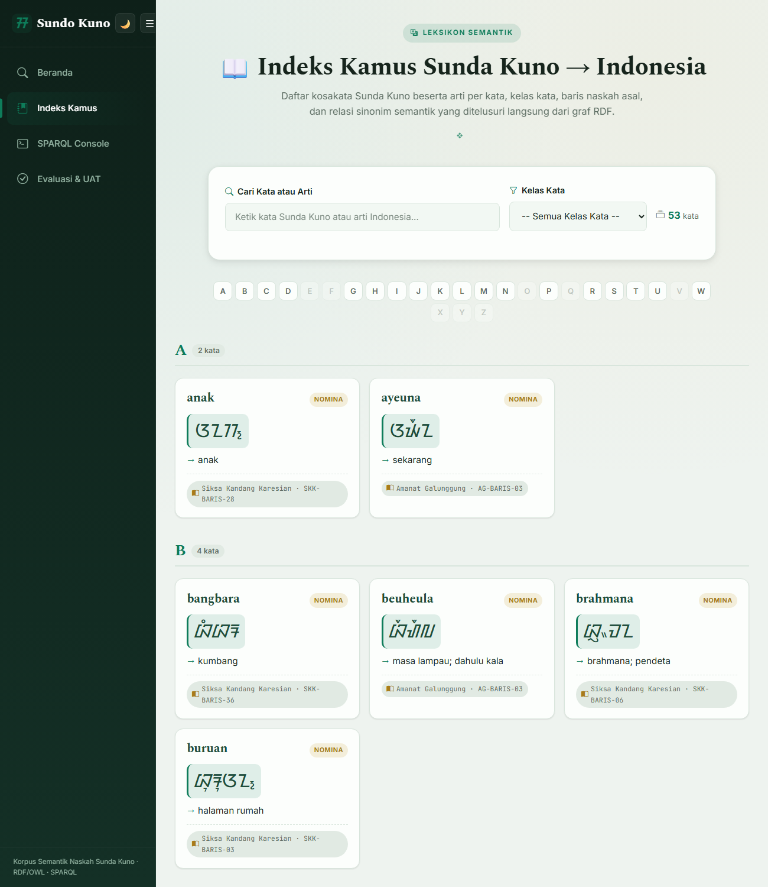
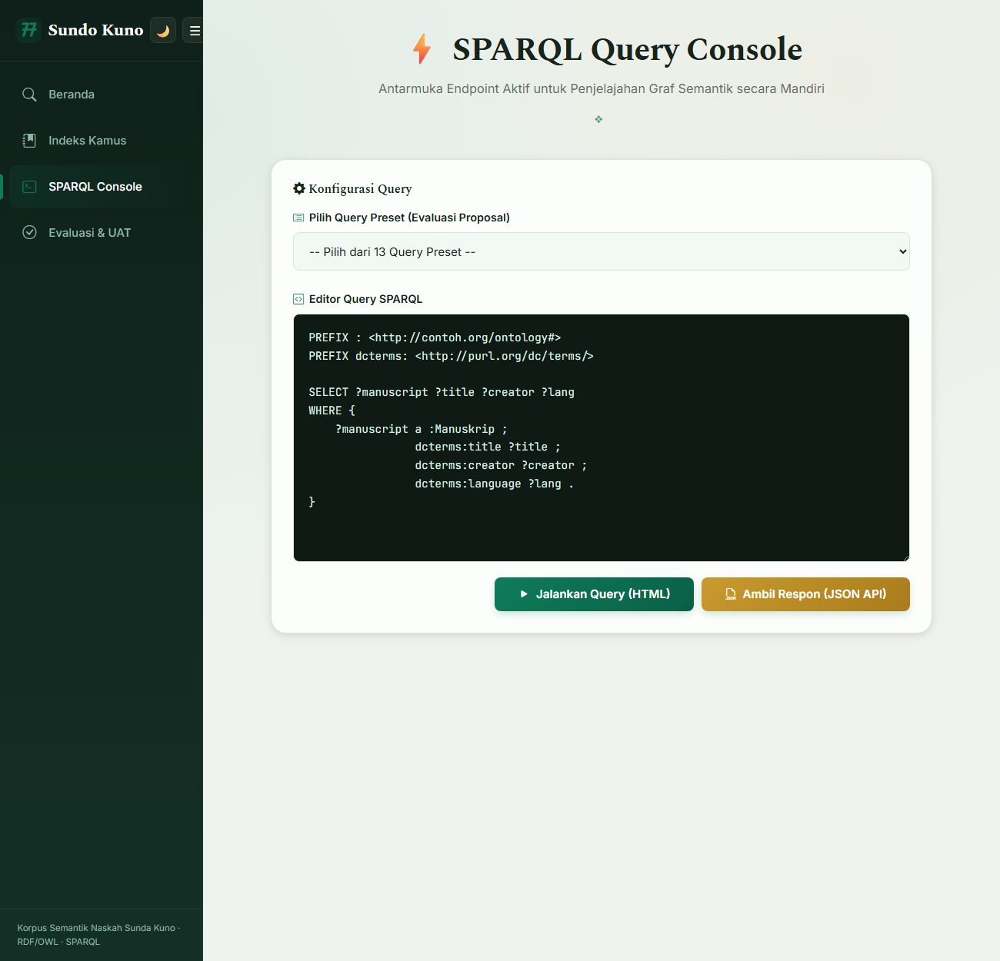
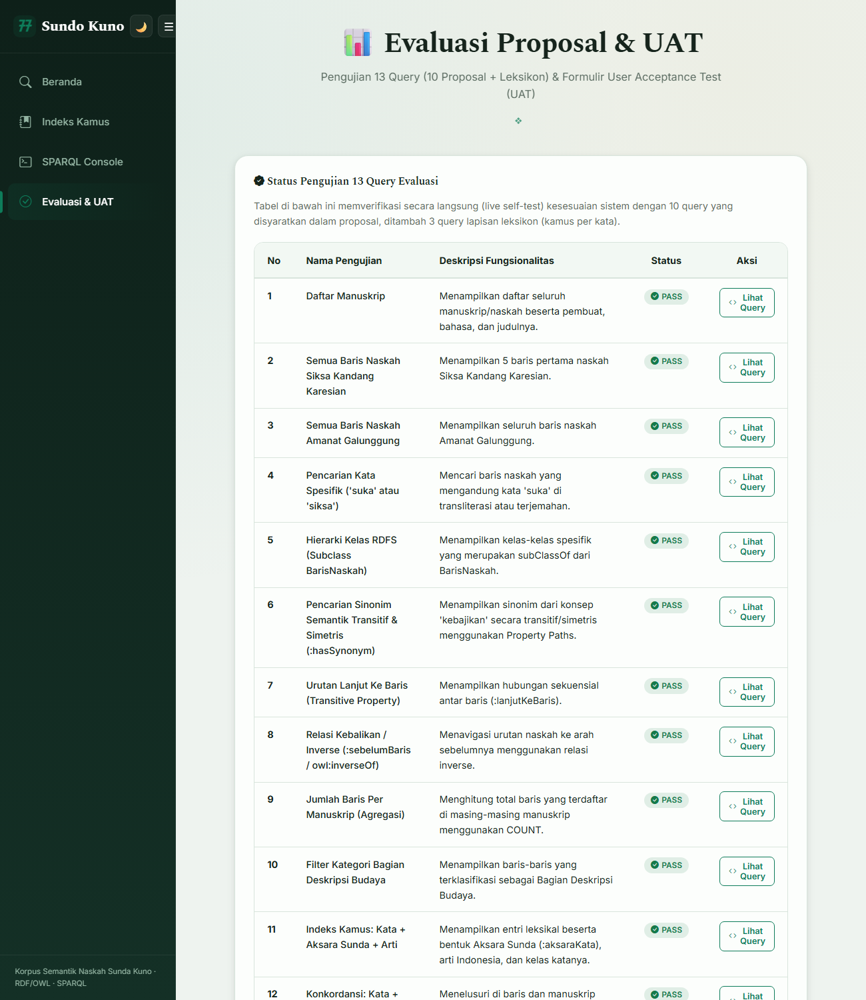

# Sundo Kuno — Korpus Semantik Naskah Sunda Kuno

Aplikasi web **Semantic Web** untuk merepresentasikan, menelusuri, dan menavigasi korpus
naskah **Sunda Kuno** sebagai graf pengetahuan (knowledge graph). Seluruh isi naskah
dimodelkan sebagai **RDF**, distrukturkan dengan **RDFS/OWL**, dan dapat ditelusuri
melalui **SPARQL**. Di atas korpus ditambahkan **lapisan leksikon (kamus per-kata)** yang
menautkan kosakata Sunda Kuno dengan arti bahasa Indonesia dan bentuk **Aksara Sunda**.

Studi kasus: fragmen naskah **Siksa Kandang Karesian** dan **Amanat Galunggung**.

> Proyek UAS Mata Kuliah Semantik Web.

---

## ✨ Fitur Utama

- **Pencarian Semantik (Beranda)** — pencarian kata kunci yang otomatis diperluas ke
  **sinonim** (relasi simetris & transitif via SPARQL Property Path), penyaringan
  berdasarkan **kategori RDFS**, dan navigasi **urutan antar-baris** (properti OWL
  transitif/inverse). Dilengkapi dashboard statistik yang dihitung langsung via SPARQL.
- **Indeks Kamus Per-Kata** — daftar kosakata Sunda Kuno A–Z beserta **arti per kata**,
  **bentuk Aksara Sunda**, kelas kata, chip sinonim, serta baris & manuskrip asal.
- **Konsol SPARQL** — editor kueri dengan 13 query preset, keluaran tabel HTML maupun
  respons JSON (SPARQL Results JSON).
- **Evaluasi & UAT** — uji mandiri (live self-test) 13 query (semua **PASS**) dan formulir
  User Acceptance Test.
- **Tema "Pakuan"** (emerald & emas) dengan mode terang/gelap dan tampilan responsif.

## 🧩 Teknologi

- **Python 3.10+**, **Flask**, **rdflib**
- Data **RDF/Turtle** (`app/dataset.ttl`) + ontologi **OWL/RDF-XML** (`ontology.owl`)
- **SPARQL 1.1** (termasuk Property Paths) untuk seluruh kueri
- Font **Noto Sans Sundanese** untuk render Aksara Sunda

## 📂 Struktur Proyek (ringkas)

```
SemWeb_Sundo_Kuno/
├── run.py                 # Titik masuk server Flask
├── run_server.bat         # Otomatisasi menjalankan server (Windows)
├── requirements.txt
├── ontology.owl           # Ontologi OWL (hasil sinkronisasi dari dataset.ttl)
├── sync_ontology.py       # Sinkronkan dataset.ttl -> ontology.owl (Protégé-compatible)
├── translit_aksara.py     # Transliterator Latin -> Aksara Sunda Baku (pembangkit :aksaraKata)
└── app/
    ├── __init__.py        # Inisialisasi Flask + pemuatan graf RDF
    ├── dataset.ttl        # Dataset RDF (korpus + leksikon)
    ├── routes/main.py     # Rute & query SPARQL
    ├── templates/         # base, index, kamus, sparql, evaluasi
    └── static/css, js     # Gaya & interaksi
```

---

## 🚀 Panduan Instalasi

**Prasyarat:** [Python 3.10+](https://www.python.org/downloads/) dan `git` terpasang.

### 1. Clone repository

```bash
git clone https://github.com/230055Fawwaz/SemWeb_Sundo_Kuno.git
cd SemWeb_Sundo_Kuno
```

### 2. Buat & aktifkan virtual environment

Gunakan nama `.semwebenv` agar kompatibel dengan `run_server.bat`.

**Windows (PowerShell/CMD):**

```bat
python -m venv .semwebenv
.semwebenv\Scripts\activate
```

**Linux / macOS:**

```bash
python3 -m venv .semwebenv
source .semwebenv/bin/activate
```

### 3. Pasang dependensi

```bash
pip install -r requirements.txt
```

### 4. Jalankan aplikasi

```bash
python run.py
```

Atau di Windows cukup jalankan **`run_server.bat`** (otomatis mengaktifkan venv,
menyalakan Flask, lalu membuka browser).

Buka **http://127.0.0.1:5000** di browser.

---

## 📖 Panduan Pengguna

### 1. Beranda — Pencarian Semantik
- Ketik **kata kunci** (transliterasi Latin atau terjemahan Indonesia), lalu klik
  **Cari Semantik & Filter**.
- Sistem otomatis mencari **sinonim** kata kunci. Contoh: mencari `kebahagiaan` juga
  memunculkan baris yang mengandung `sejahtera`.
- Pilih **Kategori Naskah (RDFS Class)** untuk menyaring berdasarkan jenis isi baris
  (Bagian Pembuka / Ajaran Moral / Deskripsi Budaya).
- Tiap kartu hasil menampilkan Aksara, transliterasi, terjemahan, serta tautan
  **baris sebelum/sesudah**.

### 2. Indeks Kamus
- Telusuri kosakata Sunda Kuno secara **A–Z**, atau gunakan kotak **pencarian langsung**
  dan filter **kelas kata**.
- Tiap kartu memuat: kata Latin, **Aksara Sunda**, arti Indonesia, kelas kata,
  **sinonim**, dan **baris + manuskrip asal** kemunculan kata.

### 3. Konsol SPARQL
- Pilih salah satu dari **13 query preset**, atau tulis kueri SPARQL sendiri.
- Klik **Jalankan Query (HTML)** untuk tabel hasil, atau **Ambil Respon (JSON API)**
  untuk SPARQL Results JSON.

### 4. Evaluasi & UAT
- Menampilkan status **live self-test** ke-13 query (PASS/FAIL) beserta kueri-nya.
- Isi **formulir UAT** untuk merekam penilaian pengguna.

---

## 🖼️ Contoh Hasil

**Beranda — pencarian semantik & statistik korpus**



**Indeks Kamus — arti per kata + Aksara Sunda**



**Konsol SPARQL**



**Evaluasi & UAT — 13 query PASS**



### Contoh kueri SPARQL

Menelusuri sinonim konsep secara **simetris & transitif** menggunakan Property Path:

```sparql
PREFIX : <http://contoh.org/ontology#>
PREFIX rdfs: <http://www.w3.org/2000/01/rdf-schema#>

SELECT DISTINCT ?sinonim WHERE {
    :konsep_bahagia (:hasSynonym|^:hasSynonym)+ ?konsep .
    ?konsep rdfs:label ?sinonim .
}
```

Karena `konsep_bahagia` ↔ `konsep_sejahtera` saling bersinonim (simetris & transitif),
kueri ini mengembalikan **`kebahagiaan`** dan **`sejahtera`** — relasi yang tidak bisa
diperoleh dari pencocokan teks biasa.

---

## 🔧 Pemeliharaan (opsional)

- **Sinkronkan ontologi** setelah mengubah `app/dataset.ttl`:

  ```bash
  python sync_ontology.py        # menghasilkan ontology.owl (kompatibel Protégé)
  ```

- **Bangkitkan Aksara Sunda** untuk kata baru pada kamus (alih aksara Latin → Aksara
  Sunda Baku, codepoint Unicode terverifikasi):

  ```bash
  python translit_aksara.py      # cetak hasil; `--map` untuk keluaran JSON
  ```

---

## 👥 Tim Pengembang

| Nama | NPM |
|------|-----|
| Stan Fredheric | 140810230046 |
| Miftah Rijallul Aziz | 140810230053 |
| Fawwaz Areefa Yaqzhan | 140810230055 |

Program Studi Teknik Informatika.
